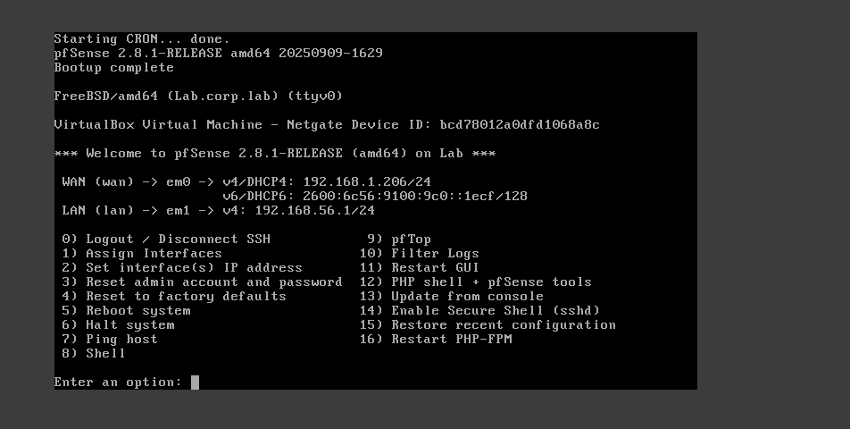
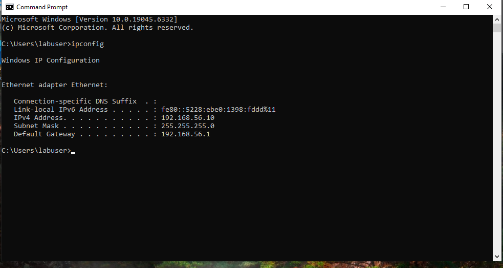
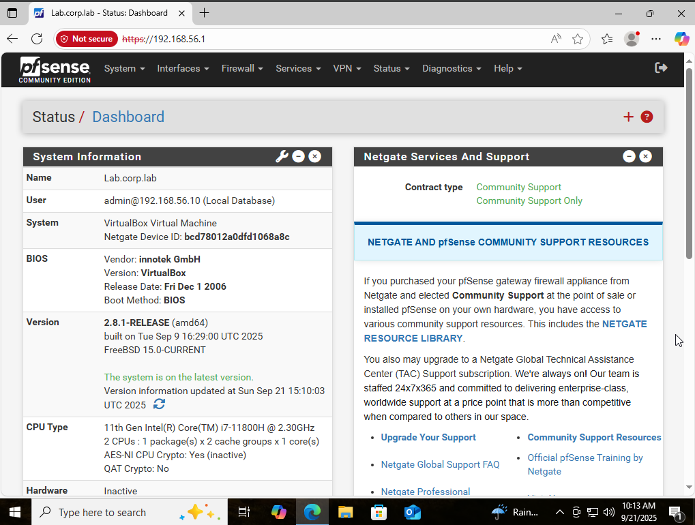
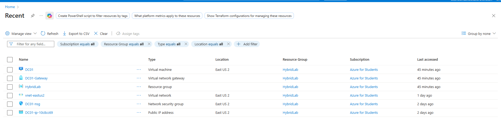
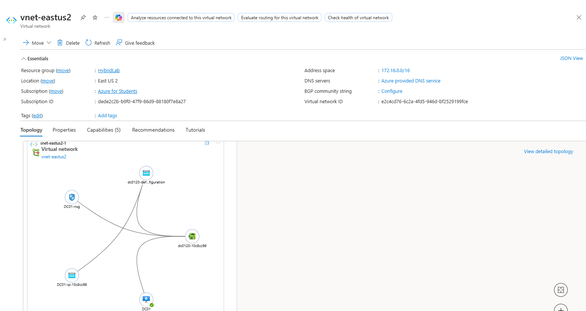
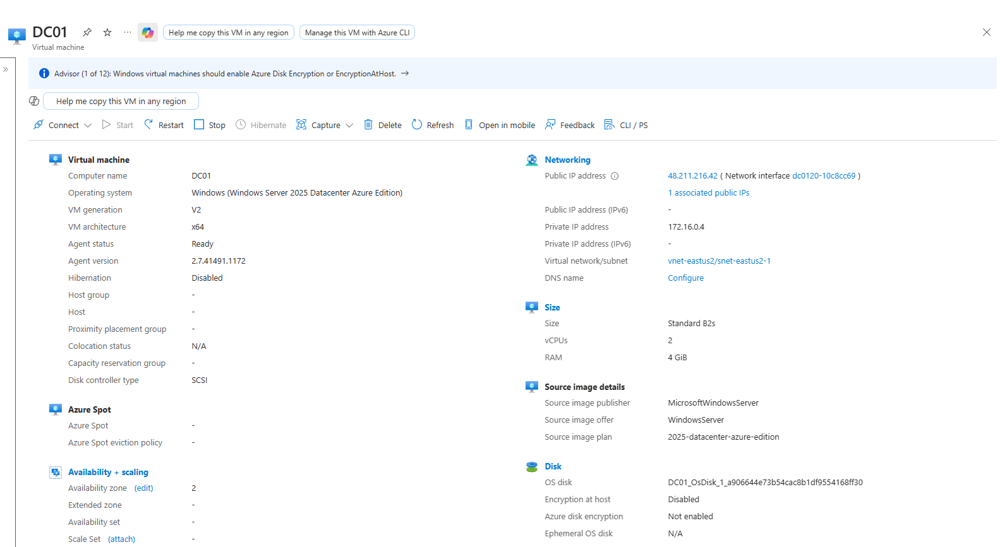

# hybrid-lab
Hybrid IT lab simulating a small enterprise network. On-prem pfSense firewall with Windows 10 client, connected to Azure VNet hosting Windows Server 2025 AD DC. Demonstrates skills in networking, AD, firewall config, and hybrid cloud integration.
# Hybrid Home/Azure Lab – Phase 1 Setup

This project documents the build of a hybrid enterprise-style lab environment designed to showcase hands-on IT and cybersecurity skills.  
The lab connects an **on-premises pfSense firewall and Windows 10 client** to an **Azure-hosted Windows Server 2025 domain controller (DC01)**, simulating a realistic hybrid enterprise.

---

## Lab Objectives
- Demonstrate understanding of hybrid networking (on-prem + cloud).
- Build foundational Active Directory and domain-join workflow.
- Configure pfSense firewall and routing for realistic enterprise architecture.
- Prepare the environment for future SIEM integration (Splunk/ELK/Wazuh).

---

## Network Diagram (Phase 1)

*(High-level network diagram showing on-prem pfSense/Win10 connected to Azure DC01)*

---

## Screenshots & Configuration

### pfSense Console (VirtualBox)
  
*Shows WAN and LAN interface assignments on pfSense VM.*

### Windows 10 Client – IP Configuration
  
*Windows 10 client configured with pfSense as default gateway.*

### pfSense WebGUI
  
*pfSense dashboard confirming system is running and reachable.*

### Azure Resource Group
  
*All resources for the lab contained in the `HybridLab` resource group.*

### Azure Virtual Network
  
*Virtual network with subnets for VM and Gateway.*

### Azure DC01 Overview
  
*Windows Server 2025 VM (DC01) acting as the Domain Controller.*

---

## Next Steps
- Configure site-to-site VPN between pfSense and Azure Virtual Network Gateway.
- Join Windows 10 client to the Active Directory domain.
- Begin configuring monitoring/visibility stack (Wazuh, Splunk, etc).
